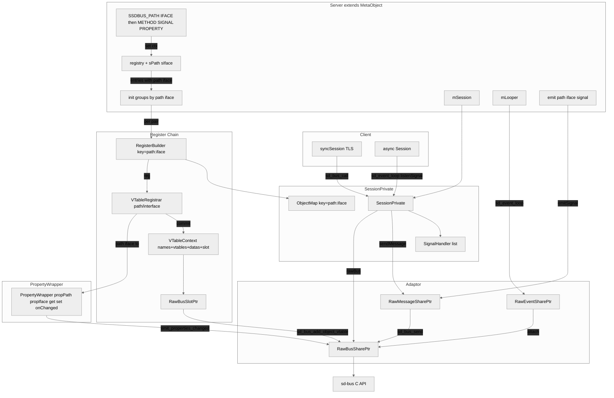

# ssdbus 项目计划

> 最后更新：2026-08-09（VTable systemd v250+ 兼容 + Server 多 path/iface 宏支持 + PropertyWrapper path/iface 自持）

---

## 一、项目完成度评估（约 95% 核心可用）

### ✅ 已完成

| 模块 | 文件 | 状态 |
|---|---|---|
| 错误体系 | `Status.hpp` + `StatusCode` (18 枚举) | ✅ 完整，分层干净 |
| Adaptor 层 | `RawCommon.hpp` | ✅ int→Status 全覆盖，仍有风格问题 |
| 消息读写 | `Message.hpp` / `MessagePrivate.hpp` | ✅ 基本类型 read/write 模板完整，**扩展 `std::map<K,V>` 读写 + dict entry 序列化** |
| 返回值封装 | `Reply.hpp` / `PendingReply.hpp` | ✅ sync/async 统一，**`static_assert` 放宽支持 vector/array/map 返回值** |
| 客户端调用 | `Method.hpp` (callSync ×1 / callAsync ×2) | ✅ **timeout 模板参数化**（`<Ret, TimeoutUsec, Args>` 单重载，零歧义）；回调 callAsync 同样统一 |
| 服务端注册 | `Method.hpp` (registerMethod / registerBuilder) | ✅ vtable 自动生成，支持链式批量注册 |
| 信号发送 | `Method.hpp` (emitSignal) | ✅ 带参/无参 |
| 信号注册 | `Method.hpp` / `RegisterBuilder` (registerSignal / addSignal) | ✅ vtable 注册 + 链式，introspect 可见 |
| VTable 管理 | `VTableRegistrar.hpp` / `RegisterBuilder` | ✅ 链式 API + commit 一次提交完整 vtable；**systemd v250+ 兼容**（`SD_BUS_VTABLE_START(0)` 宏 + `ABSOLUTE_OFFSET` + `reinterpret_cast<size_t>(ptr)` 传 userdata）；`reserve(n)` 防字符串扩容悬空；`slot` 析构顺序修正；**暴露 `path()`/`interface()` 供 PropertyWrapper 自持** (2026-08-09) |
| 信号监听 | `Method.hpp` / `SignalHandler.hpp` | ✅ 类型安全回调 |
| 会话管理 | `Session.hpp` / `SessionPrivate.hpp` | ✅ 开/关/发/收/注册；**构造函数 private**，统一通过 `systemSession()` / `userSession()` / `peerSession()` 工厂方法创建（含 `ServiceInfo` 重载）；`setInfo` 移至 private，Server 通过 friend 工厂方法调用 |
| 客户端封装 | `Client.hpp` | ✅ `Client` 远端接口代理：**双构造模式**（自管 + 外部 Looper），**全局 `static` `weak_ptr` 共享单 `AsyncPool`**（system/user/peer 各一），sync 调用通过 `post()` + `promise/future` 走 looper 线程，**SyncPool 已移除**；P2P 天然单连接无冲突；`callSync`/`callAsync`/`listenSignal`/`getProperty`/`setProperty`/`onPropertyChanged` |
| 事件循环 | `Looper.hpp` / `LooperPrivate.hpp` | ✅ sd-event 集成，IO 驱动 + 优雅退出 + **跨线程 `post()` 投递（eventfd + 任务队列 + mutex）+ `isOwnerThread()`** |
| 资源管理 | `RawSlotSharePtr` / SharePtr 系列 | ✅ RAII，移动语义完整 |
| 类型推导 | `FunctionTrait.hpp` / `DbusArgs.hpp` | ✅ 编译期萃取 + **`getSignature` 支持 `std::map`（`a{KV}`）+ `isMapV` trait** |
| 属性注册 | `Method.hpp` / `Session.hpp` / `VTableRegistrar.hpp` / `MetaObject.hpp` | ✅ 自拥有值 + `getLocalProperty`/`setLocalProperty` + `onLocalPropertyChanged` callback + `sd_bus_emit_properties_changed` + `typeid` 类型安全检查 + `SD_BUS_VTABLE_PROPERTY_EMITS_CHANGE` flag；**`SSDBUS_PROPERTY` 拆分为 `SSDBUS_PROPERTY_RO`（只读）和 `SSDBUS_PROPERTY_RW`（读写）**；**PropertyWrapper 新增 `std::mutex` 保护跨线程 get/set 竞态**；**PropertyWrapper 自持 `propPath`/`propIface`**（从 `VTableRegistrar` 传入，替代废弃的 `session->info()`）(2026-08-09) |
| 远端属性 | `PropertyHandler.hpp` / `Method.hpp` | ✅ `getRemoteProperty`/`setRemoteProperty` 走 `Properties.Get/Set`；`MessagePrivate::read` variant 自动解包；`Client::getProperty`/`setProperty` |
| 属性变更监听 | `PropertyHandler.hpp` / `Method.hpp` | ✅ `PropertiesChanged` 信号监听（sa{sv}as），**一个 handler 对应一个 (service, path) 对**（get-or-create），多次监听同一 destination 只注册一条信号匹配、多 callback 聚合；`Client::onPropertyChanged` |
| 示例 | `example/*.cpp` | ✅ 覆盖主要 API：Session 直连、Server 一站式（含反射注册+server property API）、Client 代理（自管 `example_client_internal` + 外部 Looper `example_client_external`）；**含 RO/RW property get/set/onChanged 全覆盖 + 重连测试**；`example_meta` 已删除（MetaObject 不对外暴露）(2026-08-06) |
| 反射注册 | `session/MetaObject.hpp` + `Server.hpp` | ✅ CRTP + 宏标注 → `registerObject` 一键注册：`SSDBUS_METHOD` / `SSDBUS_SIGNAL` / `SSDBUS_PROPERTY_RO` / `SSDBUS_PROPERTY_RW` 全部宏在 `Server.hpp` 中；**新增 `SSDBUS_PATH`/`SSDBUS_IFACE` 上下文宏**，支持同一 Server 多 path/iface，`init()` 自动按分组注册；`MetaObject` 移入 `session/` 子目录不对外暴露；`SSDBUS_LISTEN` 已移除，改为运行时 `session().listenSignal()` 手动注册 (2026-08-09) |
| 服务端封装 | `Server.hpp` | ✅ `Server<Derived>` 捆绑 Session + Looper + registerObject，`run()` 一行启动；`emit()` 自动线程检测（同线程直调 / 跨线程 post）；**`SSDBUS_PATH`/`SSDBUS_IFACE` 宏支持多 path/iface**，`init()` 自动按分组注册；`emit`/`getProperty`/`setProperty`/`onPropertyChanged` 均需显式传 path/iface (2026-08-09) |
| 遗留代码清理 | DbusContext/DbusManager/DbusInterface/DbusError | ✅ 全部删除 |

### 🔴 已知 Bug（按严重度）

| # | 严重度 | 文件 | 问题 |
|---|--------|------|------|
| B1 | 已关闭 | `RawCommon.hpp` | `sd_bus_message_copy` 签名 `(msg*, msg*, int)` 正确——假阳性 |
| B2 | ✅ 已修复 | `DbusArgs.hpp` | `int8_t` 映射为 `'y'` |
| B3 | ✅ 已修复 | `SessionPrivate.hpp` | `isInvalidInfo` → `isValidInfo` |
| B4 | ✅ 已修复 | `RawCommon.hpp` | `wait/process` 的 `assert(aBus)` → `if (!aBus) return -1` |
| B5 | ✅ 已修复 | `RawBusSharePtr.hpp` | 拷贝构造/赋值已加 `mIsOwned` 检查 |
| B6 | ✅ 已修复 | `RawMessageSharePtr.hpp` | 拷贝构造/赋值已加 `mIsOwned` 检查 |
| B7 | ✅ 已修复 | `MessagePrivate.hpp` | `write(string_view)` 先转 `std::string` 再 `.c_str()` |
| B8 | 设计 | `Reply.hpp` | `value()` 读失败返回默认值——调用者应先调 `isError()` 判断 |
| B9 | ✅ 已修复 | `PendingReply.hpp` | `setCallback` 改用 `shared_ptr<Reply<Ret>>`，move 安全 |
| B10 | ✅ 已修复 | `DbusArgs.hpp` / `MessagePrivate.hpp` | `float` → `double` 读写不对称 —— `write` 中显式 `static_cast<double>` |
| B11 | ✅ 已修复 | `Session.hpp` | `callAsync` 改用 `shared_ptr<vector>` 捕获，拷贝安全 |
| B12 | 🟡 风格 | `RawCommon.hpp` | `DbusException` 抛出 vs `Status` 返回混用 |
| B13 | ✅ 已修复 | `Utils.hpp` | `__safeRead`/`__safeWrite` 死码已清理，`ServiceInfo` 保留；函数迁移至 `LooperPrivate.hpp` 作私有方法 (2026-07-21) |
| B14 | ✅ 已修复 | `EventLoop.hpp` | 旧文件已删除，日志噪音已清理，由 `LooperPrivate` 替代 (2026-07-21) |
| B15 | ✅ 已修复 | `example/main.cpp` | `testUint32` 打印 `"testInt32"` |
| B16 | ✅ 已修复 | `Method.hpp` | `registerMethod` 对同一 key 两次 map 查找 |
| B17 | ✅ 已修复 | `Method.hpp` | `registerSingleSignal` 提前插入空壳 + commit 也查 map → 自己挡自己；修复：VTableRegistrar 解耦 SessionPrivate，key 统一为 name (2026-07-23) |
| B18 | 🟡 规避 | `MessagePrivate.hpp` | **systemd v249 `sd_bus_message_open_container(…, 'e', NULL)` 返回 `-EINVAL`**。v249 对 DICT_ENTRY 的 `child_type` 校验与数组打开行为冲突。**规避方案**：传内部类型字符串（如 `"si"`）代替 `nullptr`；`sd_bus_message_append("a{ss}", …)` 不受影响 (2026-07-30) |
| B19 | ✅ 已修复 | `Method.hpp` / `VTableRegistrar.hpp` | **`sd_bus_emit_properties_changed` 在 method handler 回调内返回 `-EDEADLK`**。sd-bus 内部有重入保护，回调处理中不允许再发信号。**修复**：vtable 注册时加 `SD_BUS_VTABLE_PROPERTY_EMITS_CHANGE` flag，sd-bus 识别后会放行 (2026-07-31) |
| B20 | ✅ 已修复 | `Client.hpp` | **`listenSignal`/`callAsync` 偶发阻塞**。sd-bus 非线程安全，`sd_bus_match_signal` 在 main 线程与 looper 线程的 `sd_bus_process` 竞争同一连接。**修复**：所有 async 操作通过 `promise/future` + `Looper::post()` 投递到事件循环线程串行执行 (2026-08-02) |
| B22 | ✅ 已修复 | `LooperPrivate.hpp` | **Disconnected 回调内同步操作 sd_bus → SIGSEGV**。sd-bus 分发 Disconnected 信号时回调内执行 `detach→reconnect→attach` 替换了 sd_bus 正在操作的 `sd_bus*`，return 后崩溃。**修复**：回调只 `post(doReconnect)`，延迟到当前分发完成后执行 (2026-08-05) |
| B23 | ✅ 已修复 | `SessionPrivate.hpp` | **旧 bus 释放时 slot double-free**。`closeBus + sd_bus_unref` 释放旧 bus 时 sd-bus 统一释放所有 slot，但 `VTableContext::slot` 仍持有已释放指针。后续 `reconnectSession` 替换 slot 时析构触发 `sd_bus_slot_unref` → double-free → 堆损坏。**修复**：`closeBus` 前将所有 Context 的 slot 清空（`= RawSlotSharePtr()`），此时旧 bus 还活着，unref 安全 (2026-08-05) |
| B24 | ✅ 已修复 | `Session.hpp` (`RegisterBuilder::commit`) | **`RegisterBuilder::commit()` vtable context 错配**。`mEntries` vector 顺序生成 ctx，但 `mMethods`/`mSignals`/`mProperties` 三个 `unordered_map` 迭代顺序不同，导致 method 拿到别的 method 的 vtable。重连后 `echoInt32` 被路由到 `shutdown`。**修复**：ctx 按名称匹配而非按 map 迭代索引分配 (2026-08-05) |
| B25 | ✅ 已修复 | `VTableRegistrar.hpp` | **`sd_bus_add_object_vtable` 返回 `-EINVAL`**。systemd v250+ 要求 `element_size == sizeof(sd_bus_vtable)`，且 `features=_SD_BUS_VTABLE_PARAM_NAMES` 是强制的。旧代码 `element_size=sizeof(VTableData)` 偏大 + `features=0` 非标准。**修复**：用 `SD_BUS_VTABLE_START(0)` 宏 + `ABSOLUTE_OFFSET` + `reinterpret_cast<size_t>(ptr)` 传 userdata (2026-08-09) |
| B26 | ✅ 已修复 | `VTableRegistrar.hpp` | **vtable c_str() 悬空**。循环内 `aCtx->names.push_back` 触发 vector 扩容，前面条目的 `c_str()` 指向被释放的旧内存 → sd-bus 读到垃圾。**修复**：`reserve(n)` 预分配后批量搬入字符串，再建 vtable (2026-08-09) |
| B27 | ✅ 已修复 | `VTableRegistrar.hpp` | **VTableContext 析构顺序 use-after-free**。`slot` 声明在 `names` 之前，析构时 `slot.sd_bus_slot_unref()` 访问已析构的 vtable 字符串。**修复**：`slot` 移至结构体末尾（最先析构）(2026-08-09) |
| B28 | ✅ 已修复 | `Method.hpp` / `Session.hpp` | **`PropertyWrapper::set()` 取不到 path/iface**。新 `Server` 不再调 `setInfo()`，`session->info()` 返回空。`sd_bus_emit_properties_changed` 发空 path → 客户端 `onPropertyChanged` 收不到。**修复**：`VTableRegistrar` 暴露 `path()`/`interface()`，`RegisterBuilder::addProperty` 传给 `PropertyWrapper` 自持 (2026-08-09) |

---

## 二、未实现功能（按优先级）

### P0 — 阻断性缺陷 ✅ 已全部修复（2026-06-30）

| # | 任务 | 状态 |
|---|------|------|
| P0-1 | ~~修复 `copyMessage` 编译错误~~ | 假阳性——`sd_bus_message_copy` 签名匹配 |
| P0-2 | 修复 `int8_t` D-Bus 签名 | ✅ 改为 `'y'` |
| P0-3 | 修复 `isInvalidInfo` 逻辑 | ✅ 重命名为 `isValidInfo` |
| P0-4 | `assert` → 错误返回 | ✅ `wait/process` 改为 `if (!aBus) return -1` |
| P0-5 | 修复 SharePtr ref-count | ✅ `RawBusSharePtr` + `RawMessageSharePtr` 均加 `mIsOwned` 检查 |
| P0-6 | 修复 `string_view::data()` UB + `float` 读写 | ✅ `string_view`→`string`，`float`→`double` 显式转换 |
| P0-7 | 修复 `PendingReply` `[this]` 悬空 | ✅ 改用 `shared_ptr<Reply<Ret>>` 捕获 |

### P1 — 生产就绪必要功能

| # | 任务 | 说明 |
|---|------|------|
| P1-1 | ✅ 已完成 | `PropertyWrapper`: 自拥有值 → `set()` 自动 `emit_properties_changed` + `onChange` 回调；`Session`: `getLocalProperty`/`setLocalProperty`/`onLocalPropertyChanged` + `getPropPrivate<T>` typeid 类型检查 (2026-07-02) |
| P1-2 | ✅ 数组+字典类型已完成 | `vector<T>` / `vector<vector<T>>` / `array<T,N>` / **`std::map<K,V>`** read/write + `getSignature` 递归展开（含嵌套 map `map<string, vector<int>>`） |
| P1-2a | ✅ std::map 已完成 | 字典(`a{e}`) — `MessagePrivate::read/write` 支持 `isMapV` trait；`getSignature` 生成 `a{KV}` 格式；`DICT_ENTRY` 容器序列化 |
| P1-3 | ✅ 已完成 | `callSync`/`callAsync` 远端错误 → `RawRemoteError::toStatus()`；`onCall`/`onGetter`/`onSetter` 失败时 `fromStatus()` 填充 `aErr` |
| P1-4 | ✅ 已完成（合并至 P1-3） | vtable 回调通过 `RawRemoteError::fromStatus()` 填充 `aErr` 返回对端 |
| P1-5 | ✅ 设计如此 | `Reply::value()` 读取失败返回默认值——调用者应先调 `isError()` 判断 (2026-07-20) |
| P1-6 | ✅ 已修复 | `float` 类型读写对称 —— `write` 中显式 `static_cast<double>` |
| P1-7 | 🟡 部分解决 | ~~单线程使用~~ → `Session` 仍单线程，`Server::emit()` 在服务端层面做了跨线程适配（自动检测 `isOwnerThread()`，跨线程走 `Looper::post()` 投递到事件循环执行）。调用方通过 `Server` 使用 emit 无需关心线程；直接用 `Session` 仍需自行加锁 (2026-07-25) |
| P1-8 | ✅ 已完成 | `VTableRegistrar` + `RegisterBuilder`：链式 API + 字符串生命周期托管，私有头文件不暴露 |

### P2 — 完善阶段

| # | 任务 | 说明 |
|---|------|------|
| P2-1 | **统一日志系统** | 替换 `cout/cerr/fprintf` 为可配置 log level |
| P2-2 | ✅ 已完成 | Looper/LooperPrivate 集成 sd_event，IO 事件驱动 + 优雅退出 |
| P2-3 | ✅ 已完成 | **example_server 完整测试用例**：18 项测试覆盖 sync/async/同线程 emit/跨线程 emit/信号监听/优雅关闭，双 Session 架构隔离 sync 与事件循环 fd 竞争 (2026-07-25) |
| P2-4 | ✅ Lambda 注册已完成 | `registerMethod` 支持自由函数和 lambda |
| P2-5 | ✅ 已完成 | `ReplyAsyncHandler` 持有 `RawSlotSharePtr`，RAII 自动 unref slot，无需手动 `cancel()` (2026-07-20) |
| P2-6 | **CMakeLists.txt 整理** | 移除已删除文件的引用、补充新头文件 |
| P2-7 | ✅ 已完成 | `Message::operator<<` 改为 const T&，支持右值 |
| P2-8 | ✅ 已完成 | **Looper 跨线程任务投递**：`post(std::function<void()>)` + `eventfd` 唤醒 + `std::deque` 任务队列 + `std::mutex` 保护，`isOwnerThread()` 线程检测 (2026-07-25) |
| P2-9 | ✅ 已完成 | **Client 远端代理封装**：`Client` 类封装 Session + Looper，**双构造模式**（自管 `Client(name,path,iface)` + 外部 Looper `Client(looper&, ...)`），`unique_ptr` RAII，**async 操作 `promise/future` + `post()` 线程安全**，`callSync`/`callAsync`/`listenSignal` API。外部模式多 Client 可共用 1 个 Looper (2026-08-02) |
| P2-10 | ✅ 已完成 | **远端属性读写**：`getRemoteProperty`/`setRemoteProperty` 归入 `PropertyHandler`，走 `org.freedesktop.DBus.Properties.Get/Set`；`MessagePrivate::read` 自动解包 VARIANT；`Client::getProperty`/`setProperty` + `SSDBUS_PROPERTY` 宏标注 (2026-07-31) |
| P2-11 | ✅ 已完成 | **callSync/callAsync timeout 模板参数化**：`<Ret=void, TimeoutUsec=0, Args>` 单重载消除 callSync 二义性；有回调 callAsync 同步统一 `<Ret, TimeoutUsec, Callback, Args>`，无回调 + 回调共 2 个重载风格一致 (2026-07-28) |
| P2-12 | ✅ 已完成 | **远端属性变更监听**：`PropertyHandler` 监听 `PropertiesChanged` 信号（sa{sv}as），**一个 handler 管一个 (service, path)**（get-or-create），多次监听同一 destination 只注册一条信号匹配、多 callback 聚合；`Client::onPropertyChanged` / `Method::onRemotePropertyChanged` (2026-07-31) |
| P2-13 | ✅ 已完成 | **`MessagePrivate::read` variant 自动解包**：`peek_type` 检测 `'v'` → 自动 `enterContainer` → 递归 `read` → `exitContainer`，对上层透明 (2026-07-31) |

### P3 — 锦上添花

| # | 任务 | 说明 |
|---|------|------|
| P3-1 | **API 文档** | Doxygen 注释 + README 快速入门 |
| P3-2 | **Stub/Proxy 双向代码生成** | 自定义 `.xi` IDL（IPC 无关接口描述），`xi2cpp` 后端多目标：`--dbus` → `sd-bus` 的 Stub + Proxy；`--binder` / `--grpc` 等后续扩展。单一 IDL 真相源，接口变更编译期同步报错。类型系统用通用名（`i32`/`string`/`map<string, vector<i32>>`），后端各自映射到对应 IPC 签名 |
| P3-3 | ✅ 已完成 | **连接重连**：`SessionPrivate::reconnect()` 关闭旧 bus → 创建新 bus；`Reconnect.hpp::reconnectSession()` 遍历全部注册项重调 `sd_bus_add_object_vtable`/`sd_bus_match_signal`；`LooperPrivate` 监听 `Disconnected` 信号 + `post()` 异步重连 + 重连后重新注册 Disconnected 监听；`Client::callSync()` 检测连接错误 → `session.rebuild()` → 重试 (2026-08-05) |
| P3-4 | **name owner 追踪** | 封装 `sd_bus_track` 或 `NameOwnerChanged` |
| P3-5 | **peer-to-peer 连接** | `sd_bus_open()` P2P 模式 |
| P3-6 | ✅ 已完成 | `RawCommon.hpp` 拆分 → RawBus/RawMessage/RawSlot/RawEvent/RawErrorConvert (2026-07-20) |
| P3-7 | ✅ 已完成 | **`FuncTrait` 补全**：noexcept/&/&&/const &/const && 及 noexcept 组合共 14 个偏特化，覆盖 lambda operator() 全部 cv-ref 限定符版本 (2026-08-05) |
| P3-8 | 🟡 按需 | **变体类型 (`v`)**：已有 `MessagePrivate::read` variant 自动解包已覆盖 `Properties.Get` 场景，`PropertiesChanged` 由 PropertyHandler 手动解析。无外部 `a{sv}` 对接需求前不实施 |
| P3-9 | ✅ std::map 已完成 | `std::map<K, V>` ↔ `a{KV}` — 完整 read/write + getSignature + 嵌套 map |
| P3-10 | **单元测试** | 现有 `example/` 为集成测试（依赖 D-Bus daemon），缺无外部依赖的单元测试。覆盖项：Status 构造/比较、`getSignature` 类型→签名映射、`FuncTrait` 萃取正确性、`MessagePrivate::read/write` 基本类型/容器 round-trip、`PropertyWrapper` set/get 逻辑、`RawErrorConvert::fromErrno` 映射完整 |

---

## 三、当前优先级路线图

```
P0 — ✅ 全部完成（2026-06-28）

P1 — ✅ 全部完成（2026-07-09）
  ├─ ✅ VTableRegistrar 封装             ← 链式 API + 字符串托管
  ├─ ✅ Property get/set/onChanged      ← PropertyWrapper 自拥有值 + typeid 类型安全 + callback
  ├─ ✅ vector<T> 数组类型               ← read/write 递归展开 + getSignature 递归
  └─ ✅ 远端错误双向传递                 ← toStatus() / fromStatus() 映射表 + callSync/callAsync/onCall

P2 — 完善阶段
  ├─ ✅ Lambda 注册                    ← 自由函数 + lambda
  ├─ ✅ 事件循环改进                    ← Looper 集成 sd_event，IO 驱动替代忙循环
  ├─ ✅ MetaObject 反射注册             ← SSDBUS_METHOD / SSDBUS_SIGNAL / SSDBUS_PROPERTY_RO / SSDBUS_PROPERTY_RW + registerObject（SSDBUS_LISTEN 已移除）
  ├─ ✅ Server 一站式封装               ← Server<T> = Session + Looper + registerObject；protected looper() 支持子类内嵌 Client
  ├─ ✅ Client 远端代理                 ← 双模式 + TLS weak_ptr 共享池 + promise/future 线程安全 + 内嵌 self-client loopback
  ├─ ✅ std::map<K,V> 支持             ← read/write + getSignature(a{KV}) + 嵌套 map
  ├─ ✅ 远端属性读写                     ← Properties.Get/Set + variant 自动解包 + Client::getProperty/setProperty
  ├─ ✅ 远端属性变更监听                 ← PropertyHandler + onPropertyChanged + SD_BUS_VTABLE_PROPERTY_EMITS_CHANGE
  ├─ 日志系统
  └─ 预计工作量: ~0.5 天

P3 — 锦上添花
  └─ 视需求决定
```

---

## 四、架构总览

### 分层架构

```mermaid
%%{init: {'theme': 'neutral', 'themeVariables': { 'edgeLabelBackground':'#2d2d2d' }}}%%
graph TD
    subgraph 业务层["Business Layer"]
        Client["Client TLS weak_ptr shared pool"]
        Server["Server Session Looper registerObject SSDBUS_PATH/IFACE"]
        Session["Session user entry"]
        MetaObject["MetaObject CRTP reflection base sPath/sIface ctx"]
        RegisterBuilder["RegisterBuilder chain registration"]
        Reply["Reply / PendingReply return value"]
    end

    subgraph 逻辑层["Logic Layer"]
        Method["Method / MethodWrapper dispatch"]
        PropertyWrapper["PropertyWrapper self-held path/iface get/set/onChanged"]
        VTableRegistrar["VTableRegistrar vtable builder expose path/interface"]
        VTableContext["VTableContext names+inputs+outputs+vtables+datas slot last"]
        FuncTrait["FuncTrait compile-time signature extract"]
        SignalHandler["SignalHandler type-erased callback"]
    end

    subgraph 适配层["Adaptor Layer"]
        RawBus["RawBusSharePtr sd_bus RAII"]
        RawMsg["RawMessageSharePtr sd_bus_message RAII"]
        RawSlot["RawSlotSharePtr sd_bus_slot RAII"]
        RawEvent["RawEventSharePtr sd_event RAII"]
        RawCommon["RawCommon type alias + validation"]
        RawError["RawRemoteError / RawErrorConvert sd_bus_error to Status"]
    end

    subgraph 纯类型层["Pure Type Layer"]
        Status["Status.hpp StatusCode / Status"]
    end

    业务层 -->|one-way depends| 逻辑层
    逻辑层 -->|one-way depends| 适配层
    适配层 -->|one-way depends| 纯类型层
```



### 关键组件关系



---


## 五、关键设计决策记录

| 决策 | 结论 |
|---|---|
| 错误处理范式 | Status 返回值，不加 operator bool，不抛异常 |
| errno 映射位置 | RawCommon.hpp 的 RawErrorConvert 命名空间，不在 Status.hpp |
| StatusCode 语义 | 按 sd-bus 上下文语义映射，不机械翻译 POSIX 宏名 |
| 回调清理 | RAII Scope Guard + enable_shared_from_this |
| 重载决议 | Callback 用独立模板参数 `Callback&&`，不用 `std::function` |
| 声明注册分离 | 用 `SSDBUS_METHOD(name)` 紧挨声明标注，实现放 `.cpp` |
| 反射注册 | CRTP `MetaObject<Derived>`逐类独立 registry + `RegisterFunc` 类型擦除，`Session::registerObject` 通过 `MetaObject<T>::registry()` 按名分发。`MetaObject` 藏于 `session/` 子目录作为 `Session` ↔ `Server` 的最小契约，用户不直接接触 (2026-08-06) |
| 分层原则 | 依赖方向：不稳定（平台层）→ 稳定（类型层） |
| 跨线程 emit | `Server::emit()` 在服务端层面做了跨线程适配：自动检测 `isOwnerThread()`，同线程直调 `Session::emitSignal()`（同步返回 Status），跨线程通过 `Looper::post()` 投递（eventfd + mutex 保护队列 + swap 最小化锁持有），返回 `SUCCESS` 表示已入队。**`Session` 本身仍单线程**——直接使用 `Session::emitSignal()` 需自行加锁 |
| 双 Session 隔离 | 已废弃。**Client 改为单 `AsyncPool` 架构**：sync/async 全部走同一个 looper 线程，`callSync` 内部 `post()` + `promise/future` 阻塞等待，消除双 `sd_bus*` 的 fd 竞争。P2P 模式下天然兼容（单连接） |
| `std::apply` + 成员函数指针 | **不可行**：`obj->*func` 不是 Callable；必须用 lambda 包装 |
| SignalHandler 设计 | `FuncTrait` 提取签名 → `MessagePrivate::read` 反序列化 → `std::apply` 调用回调 |
| listenSignal 时序 | **必须先 `listenSignal` 再 `setInfo`**，否则 `NameAcquired` 丢失 |
| `listenSignal` vs `NameOwnerChanged` | `NameAcquired` 仅 unicast；监控其他连接需 `NameOwnerChanged`（broadcast） |
| emitSignal + registerSignal 分离 | `emitSignal` 只发送消息；`registerSignal` 注册 vtable 使 introspect 可见 |
| RawMessageSharePtr vs RawBusSharePtr | `RawMessageSharePtr` 包装 `sd_bus_message*`，`RawBusSharePtr` 包装 `sd_bus*`，不可混用 |
| SharePtr 所有权语义 | `owned=true` 时析构调用 `unref`；`owned=false` 仅 borrow。拷贝时应仅在 `owned=true` 时 ref |
| callSync 超时语义 | `timeout=0` 在 sd-bus 中表示"默认超时"（~25s），非"无限等待"。`UINT64_MAX` 才表示无限 |
| callAsync 回调生命周期 | **禁止 lambda 捕获 `this`**：`PendingReply` / `Clear` RAII 中一律用 `shared_ptr` 捕获（`RepsPtr`、`key`），确保 Session 拷贝/move 后回调仍安全。`PendingRepsV` 用 `shared_ptr<vector>` 包装，Session 析构时统一回收 |
| callAsync 清理策略 | 回调完成后从 `mRepsPtr` 中 `erase` 已完成的 `PendingReply`，避免 vector 无限增长。`shared_ptr<void>` 可直接用 `std::find` 比较，无需 `void*` + lambda 匹配 |
| VTableRegistrar 设计 | **方案 B（链式 API + 字符串托管）**：`Session::registerBuilder()` 返回 `RegisterBuilder`，支持 `.addMethod().addSignal().commit()`。`VTableContext` 自持 `names/inputs/outputs` 字符串 + vtables/datas + slot（slot 放最后确保先析构）。systemd v250+ 兼容：`SD_BUS_VTABLE_START(0)` 宏 + `ABSOLUTE_OFFSET` + `reinterpret_cast<size_t>(ptr)` 传 userdata。`reserve(n)` 预分配字符串防扩容 → `c_str()` 悬空。暴露 `path()`/`interface()` 供 `PropertyWrapper` 用 (2026-08-09) |
| Method/Signal key 策略 | 使用纯 name 作为 map key（非 name+input），因 D-Bus 协议层面同名 method/signal 只能有唯一签名。registerBuilder 内 `mMethods[aName]` 和 `mSignals[regName]` 统一用 name 索引 |
| registerSingleSig/Method 可叠加 | `sd_bus_add_object_vtable` 支持多次调用叠加；注册 API 的 `registerMethod`/`registerSignal` 每个独立 commit vtable，依赖 sd-bus 自动合并 |
| RegisterBuilder 生命周期 | `RegisterBuilder` 作为 `Session` 内嵌 struct，`commit()` 将 `MethodMap`/`SignalMap` 移入 `SessionPrivate`，Builder 析构不持有任何注册资源 |
| Server 封装 | `Server<Derived>` 捆绑 Session + Looper + `registerObject(this)`，`run()` 一行启动完整服务。构造走 `Session` 工厂方法，move-only（不可拷贝），`stop()` 优雅退出。**多 path/iface 支持**：`SSDBUS_PATH(p)`/`SSDBUS_IFACE(i)` 宏设上下文 → `SSDBUS_METHOD`/`SSDBUS_SIGNAL`/`SSDBUS_PROPERTY` 自动关联当前 (path, iface)；`init()` 按 `(path, iface)` 分组逐个 `registerBuilder`。`emit`/`getProperty`/`setProperty`/`onPropertyChanged` 均需显式传 path/iface (2026-08-09) |
| Client 封装 | `Client` = **单 `AsyncPool`**（Session + Looper + thread，全局 `static weak_ptr` 共享）。`callSync` 内部 `post()` + `promise/future` 走 looper 线程；`callAsync`/`listenSignal` 同走 `mAsyncPtr`。`AsyncPool` 懒初始化，`weak_ptr::lock()` 复用已存在实例；最后一个 `Client` 析构后 pool refcount→0 自动清理。**SyncPool 已删除** (2026-08-06) |
| Session 工厂方法 | `Session` 构造函数 private，创建必须通过三个工厂：`systemSession()` / `userSession()` / `peerSession(aSocket)`，各有无参（纯 client）和 `ServiceInfo` 重载（server 用，内部 `setInfo`）。`setInfo` 从 public API 隐藏，Server 通过工厂方法 `Session::userSession(aInfo)` 间接调用 |
| callSync 重载合并 | `Ret=void` 设默认参数，消去 void 特化版本。timeout 从函数参数提升为模板参数 `<Ret=void, TimeoutUsec=0, Args>`，彻底消除 timeout/no-timeout 二义性。无回调 callAsync 同步统一；有回调 callAsync 复用同一模板参数模式 |
| std::map 支持 | `DbusArgs.hpp` 新增 `isMapV` trait（检测 `std::map` 特化），`getSignature` 递归生成 `a{KV}` 格式签名。`MessagePrivate::read/write` 通过 `isMapV` 分支处理 dict entry 容器：外层 `ARRAY`（`{KV}`）+ 内层 `DICT_ENTRY`（传内部类型字符串如 `"si"`，克服 systemd v249 `child_type` 校验 bug）。`Reply`/`PendingReply` 的 `static_assert` 放宽到 `isVectorV || isArrayV || isMapV`，支持 map 作为返回值类型 |
| PropertiesChanged 重入保护 | `sd_bus_emit_properties_changed` 在 method handler 回调内调用会触发 sd-bus 内部重入保护，返回 `-EDEADLK`（非 `-EDEADLK` 实际为 `-EDOM`，systemd 249 可能映射有误）。解决方案：vtable 注册 property 时加 `SD_BUS_VTABLE_PROPERTY_EMITS_CHANGE` flag，告知 sd-bus "我会自己发信号"，sd-bus 识别后放行回调内的 `sd_bus_emit_properties_changed` 调用 (2026-07-31) |
| PropertyHandler 设计 | 远端属性变更监听走 `PropertyHandler`，一个 handler 管理一个 (service, path) 对（key = `"service:path"`，存入 `SessionPrivate::mPropHandlers` map）。`onRemotePropertyChanged` 首次调用时创建 handler + 注册 `PropertiesChanged` 信号匹配；后续同一 destination 的监听只 add callback，复用已有 handler。handler 生命周期由 `SessionPrivate` 的 `shared_ptr<void>` map 持有 (2026-07-31) |
| MessagePrivate::read variant 自动解包 | `MessagePrivate::read` 开头通过 `sd_bus_message_peek_type` 嗅探当前位置类型：若为 `'v'`，自动 `enterContainer('v', getSignature<T>())` → 递归 `read` → `exitContainer`。这使得 `Reply<Ret>::value()` 对 `Properties.Get` 返回的 VARIANT 透明，`getRemoteProperty` 无需手动解包 (2026-07-31) |
| SSDBUS_PROPERTY / SSDBUS_PATH / SSDBUS_IFACE | `SSDBUS_PROPERTY_RO/RW` 不创建成员变量——`PropertyWrapper<T>` 内部自持数据副本。宏注册 lambda 捕获 `initValue` 直接传给 `RegisterBuilder::addProperty<T>`。`SSDBUS_PATH(p)`/`SSDBUS_IFACE(i)` 设 `MetaObject::sPath/sIface` 静态上下文变量，后续 `SSDBUS_METHOD`/`SSDBUS_SIGNAL`/`SSDBUS_PROPERTY` 自动捕获当前 (path, iface)。利用 C++ 静态初始化顺序保证正确性 (2026-08-09) |
| setRemoteProperty variant 包装 | `Properties.Set` D-Bus 签名 `ssv`（STRING iface, STRING prop, VARIANT value）。`setRemoteProperty` 先 `write(iface, prop)`，再 `openContainer('v', getSignature<T>())` → `write(value)` → `closeContainer`。对 `std::vector<T>` 等复杂类型同样适用 (2026-07-31) |
| 连接重连机制 | `SessionPrivate::reconnect()` 重建总线连接；`Reconnect.hpp::reconnectSession()` 遍历所有 maps/vectors 重放注册；`LooperPrivate::doReconnect()` 编排 detach→reconnect→attach→registerDisconnectedHandler 流程。Disconnected 回调 `post()` 异步执行避免 sd-bus 重入崩溃。P2P 模式 `mInfo.name.empty()` 时跳过 `setInfo`（无 bus daemon，不需要 request name）。重连由 looper 自动处理，Client 无需手动 `rebuild()` (2026-08-06) |
| RegisterBuilder commit ctx 错配 | `RegisterBuilder::commit()` 用 `mEntries`(vector) 顺序生成 ctx，但用 `mMethods`(unordered_map) 哈希序分配——必须按 ctx->name 匹配而非索引 (2026-08-05) |
| systemd v250+ vtable 兼容 | systemd v250+ `sd_bus_vtable` 结构变化（位域 type/flags、method.names 字段、`sd_bus_object_vtable_format` 变 `const unsigned`）。`SD_BUS_VTABLE_START(0)` 宏强制 `features=_SD_BUS_VTABLE_PARAM_NAMES` + `element_size=sizeof(sd_bus_vtable)`。`ABSOLUTE_OFFSET` 直接把 `void*` 塞 `size_t offset` — sd-bus 解为 `(void*)(uintptr_t)offset`。`VTableContext::slot` 必须放最后（最先析构），字符串 vectors 在其之前析构。`reserve(n)` 防扩容 → `c_str()` 悬空 (2026-08-09) |
| PropertyWrapper path/iface 自持 | 旧设计依赖 `session->info()` 获取 path/iface，但新 `Server` 支持多 path/iface 后不再设单一 `info`。`VTableRegistrar` 暴露 `path()`/`interface()`，`RegisterBuilder::addProperty` 传给 `PropertyWrapper` 构造时存储，`set()` 用自持的 `propPath`/`propIface` 调 `sd_bus_emit_properties_changed` (2026-08-09) |
