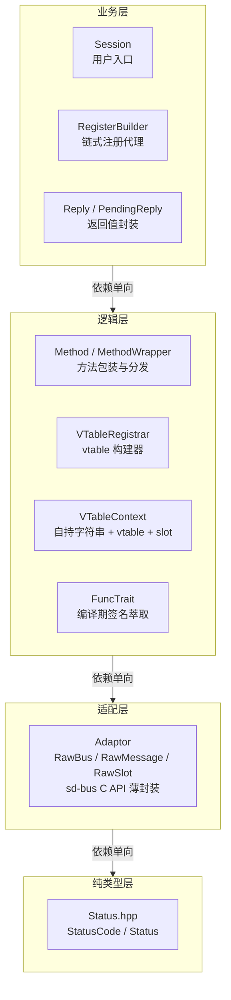
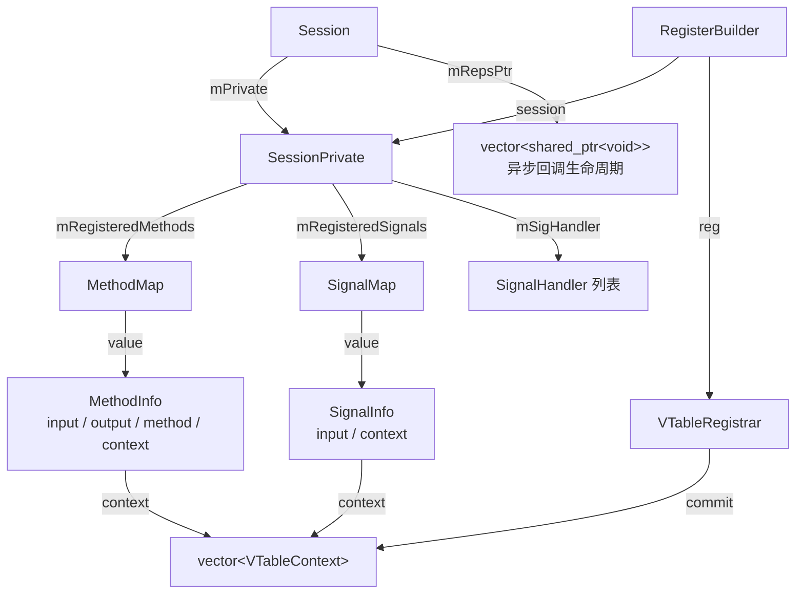

# ssdbus 项目计划

> 最后更新：2026-06-30（VTableRegistrar 完成，Bug 修复收尾）

---

## 一、项目完成度评估（约 85% 核心可用）

### ✅ 已完成

| 模块 | 文件 | 状态 |
|---|---|---|
| 错误体系 | `Status.hpp` + `StatusCode` (18 枚举) | ✅ 完整，分层干净 |
| Adaptor 层 | `RawAdaptor.hpp` | ✅ int→Status 全覆盖，仍有风格问题 |
| 消息读写 | `Message.hpp` / `MessagePrivate.hpp` | ✅ 基本类型 read/write 模板完整 |
| 返回值封装 | `Reply.hpp` / `PendingReply.hpp` | ✅ sync/async 统一 |
| 客户端调用 | `Method.hpp` (callSync ×4 / callAsync ×2) | ✅ 带参/无参、带/不带回调 |
| 服务端注册 | `Method.hpp` (registerMethod / registerBuilder) | ✅ vtable 自动生成，支持链式批量注册 |
| 信号发送 | `Method.hpp` (emitSignal) | ✅ 带参/无参 |
| 信号注册 | `Method.hpp` / `RegisterBuilder` (registerSignal / addSignal) | ✅ vtable 注册 + 链式，introspect 可见 |
| VTable 管理 | `VTableRegistrar.hpp` / `RegisterBuilder` | ✅ 链式 API：`.addMethod().addSignal().commit()`，字符串生命周期由 `VTableContext` 托管 |
| 信号监听 | `Method.hpp` / `SignalHandler.hpp` | ✅ 类型安全回调 |
| 会话管理 | `Session.hpp` / `SessionPrivate.hpp` | ✅ 开/关/发/收/注册 |
| 事件循环 | `DbusEventLoop.hpp` | ✅ 可用（调试日志过多） |
| 资源管理 | `DbusSlot.hpp` / SharePtr 系列 | ✅ RAII，移动语义完整 |
| 类型推导 | `FunctionTrait.hpp` / `DbusArgs.hpp` | ✅ 编译期萃取 |
| 示例 | `example/main.cpp` | ✅ 覆盖主要 API |
| 遗留代码清理 | DbusContext/DbusManager/DbusInterface/DbusError | ✅ 全部删除 |

### 🔴 已知 Bug（按严重度）

| # | 严重度 | 文件 | 问题 |
|---|--------|------|------|
| B1 | 假阳性 | `RawAdaptor.hpp` | `sd_bus_message_copy` 签名是 `(msg*, msg*, int)`，调用正确 |
| B2 | ✅ 已修复 | `DbusArgs.hpp` | `int8_t` 映射为 `'y'` |
| B3 | ✅ 已修复 | `SessionPrivate.hpp` | `isInvalidInfo` → `isValidInfo` |
| B4 | ✅ 已修复 | `RawAdaptor.hpp` | `wait/process` 的 `assert(aBus)` → `if (!aBus) return -1` |
| B5 | ✅ 已修复 | `RawBusSharePtr.hpp` | 拷贝构造/赋值已加 `mIsOwned` 检查 |
| B6 | ✅ 已修复 | `RawMessageSharePtr.hpp` | 拷贝构造/赋值已加 `mIsOwned` 检查 |
| B7 | ✅ 已修复 | `MessagePrivate.hpp` | `write(string_view)` 先转 `std::string` 再 `.c_str()` |
| B8 | 设计 | `Reply.hpp` | `value()` 读失败返回默认值——调用者应先调 `isError()` 判断 |
| B9 | ✅ 已修复 | `PendingReply.hpp` | `setCallback` 改用 `shared_ptr<Reply<Ret>>`，move 安全 |
| B10 | ✅ 已修复 | `DbusArgs.hpp` / `MessagePrivate.hpp` | `float` → `double` 读写不对称 —— `write` 中显式 `static_cast<double>` |
| B11 | ✅ 已修复 | `Session.hpp` | `callAsync` 改用 `shared_ptr<vector>` 捕获，拷贝安全 |
| B12 | 🟡 风格 | `RawAdaptor.hpp` | `DbusException` 抛出 vs `Status` 返回混用 |
| B13 | 🟡 死码 | `Utils.hpp` | `__safeRead`/`__safeWrite` 保留标识符 + 无调用者 |
| B14 | 🟡 日志 | `DbusEventLoop.hpp` | 每次迭代 5 条 fprintf(stderr) |
| B15 | 🟡 复制 | `example/main.cpp` | `testUint32` 打印 `"testInt32"` |
| B16 | 🟡 效率 | `Method.hpp` | `registerMethod` 对同一 key 两次 map 查找 |

---

## 二、未实现功能（按优先级）

### P0 — 阻断性缺陷 ✅ 已全部修复（2026-06-30）

| # | 任务 | 状态 |
|---|------|------|
| P0-1 | ~~修复 `copyMessage` 编译错误~~ | 假阳性——`sd_bus_message_copy` 签名匹配 |
| P0-2 | 修复 `int8_t` D-Bus 签名 | ✅ 改为 `'y'` |
| P0-3 | 修复 `isInvalidInfo` 逻辑 | ✅ 重命名为 `isValidInfo` |
| P0-4 | `assert` → 错误返回 | ✅ `wait/process` 改为 `if (!aBus) return -1` |
| P0-5 | 修复 SharePtr ref-count | ✅ `RawBusSharePtr` + `RawMessageSharePtr` 均加 `mIsOwned` 检查 |
| P0-6 | 修复 `string_view::data()` UB + `float` 读写 | ✅ `string_view`→`string`，`float`→`double` 显式转换 |
| P0-7 | 修复 `PendingReply` `[this]` 悬空 | ✅ 改用 `shared_ptr<Reply<Ret>>` 捕获 |

### P1 — 生产就绪必要功能

| # | 任务 | 说明 |
|---|------|------|
| P1-1 | **Property get/set** | vtable 支持 `SD_BUS_PROPERTY` / `SD_BUS_WRITABLE_PROPERTY` |
| P1-2 | **复杂 D-Bus 类型** | 数组(`a`)、变体(`v`)、字典(`a{e}`)、object path(`o`)、Unix fd(`h`) |
| P1-3 | **远端错误信息传递** | `callSync` 传入 `sd_bus_error*`，`Status` 增加携带 error name/message |
| P1-4 | **vtable 回调错误返回** | `IMethodWrapper::call` 使用 `RawBusErrorPtr aErr` 参数 |
| P1-5 | **`Reply::value()` 错误检查** | 读取失败时返回默认值——设计如此，同 B8 |
| P1-6 | ✅ 已修复 | `float` 类型读写对称 —— `write` 中显式 `static_cast<double>` |
| P1-7 | **线程安全声明** | 至少明确"单线程使用"，或加 `std::mutex` |
| P1-8 | ✅ 已完成 | `VTableRegistrar` + `RegisterBuilder`：链式 API + 字符串生命周期托管，私有头文件不暴露 |

### P2 — 完善阶段

| # | 任务 | 说明 |
|---|------|------|
| P2-1 | **统一日志系统** | 替换 `cout/cerr/fprintf` 为可配置 log level |
| P2-2 | **事件循环改进** | 集成 sd-event、支持定时器、去掉忙循环 |
| P2-3 | **单元测试** | Status、fromErrno、Message read/write、信号收发 |
| P2-4 | **Lambda 注册** | `registerMethod` 支持自由函数和 lambda |
| P2-5 | **`PendingReply` 取消** | 暴露 `cancel()` → `sd_bus_slot_unref` |
| P2-6 | **CMakeLists.txt 整理** | 移除已删除文件的引用、补充新头文件 |
| P2-7 | **`Message::operator<<` const T&** | 当前非 const 引用阻止传入右值 |

### P3 — 锦上添花

| # | 任务 | 说明 |
|---|------|------|
| P3-1 | **API 文档** | Doxygen 注释 + README 快速入门 |
| P3-2 | **自动 introspect** | 遍历注册表自动生成 XML |
| P3-3 | **连接重连** | 断线自动重连 + 重新注册 vtable |
| P3-4 | **name owner 追踪** | 封装 `sd_bus_track` 或 `NameOwnerChanged` |
| P3-5 | **peer-to-peer 连接** | `sd_bus_open()` P2P 模式 |
| P3-6 | **`RawAdaptor.hpp` 拆分** | 900 行单体 → RawBus/RawMessage/RawSlot/RawError |
| P3-7 | **`FuncTrait` 补全** | noexcept/volatile/引用限定符版本 |

---

## 三、当前优先级路线图

```
P0 — ✅ 全部完成（2026-06-28）

P1 — 当前迭代 🚀
  ├─ ✅ VTableRegistrar 封装             ← 链式 API + 字符串托管已完成
  ├─ Property get/set                   ← 基于 VTableRegistrar，加 addProperty
  ├─ 复杂类型（数组/变体/字典）           ← 扩展适用范围
  ├─ 远端错误信息 + vtable 错误返回       ← 健壮性
  └─ 预计工作量: 1-2 周

P2 — 完善阶段
  ├─ 日志系统 + 事件循环改进
  ├─ 单元测试 + Lambda 注册
  └─ 预计工作量: 1 周

P3 — 锦上添花
  └─ 视需求决定
```

---

## 四、架构总览

### 分层架构



### 关键组件关系



---

## 五、关键设计决策记录

| 决策 | 结论 |
|---|---|
| 错误处理范式 | Status 返回值，不加 operator bool，不抛异常 |
| errno 映射位置 | RawAdaptor.hpp 的 RawError 命名空间，不在 Status.hpp |
| StatusCode 语义 | 按 sd-bus 上下文语义映射，不机械翻译 POSIX 宏名 |
| 回调清理 | RAII Scope Guard + enable_shared_from_this |
| 重载决议 | Callback 用独立模板参数 `Callback&&`，不用 `std::function` |
| DbusException | 逐步消除，统一为 Status 返回值 |
| 分层原则 | 依赖方向：不稳定（平台层）→ 稳定（类型层） |
| `std::apply` + 成员函数指针 | **不可行**：`obj->*func` 不是 Callable；必须用 lambda 包装 |
| SignalHandler 设计 | `FuncTrait` 提取签名 → `MessagePrivate::read` 反序列化 → `std::apply` 调用回调 |
| listenSignal 时序 | **必须先 `listenSignal` 再 `setInfo`**，否则 `NameAcquired` 丢失 |
| `listenSignal` vs `NameOwnerChanged` | `NameAcquired` 仅 unicast；监控其他连接需 `NameOwnerChanged`（broadcast） |
| emitSignal + registerSignal 分离 | `emitSignal` 只发送消息；`registerSignal` 注册 vtable 使 introspect 可见 |
| RawMessageSharePtr vs RawBusSharePtr | `RawMessageSharePtr` 包装 `sd_bus_message*`，`RawBusSharePtr` 包装 `sd_bus*`，不可混用 |
| SharePtr 所有权语义 | `owned=true` 时析构调用 `unref`；`owned=false` 仅 borrow。拷贝时应仅在 `owned=true` 时 ref |
| callSync 超时语义 | `timeout=0` 在 sd-bus 中表示"默认超时"（~25s），非"无限等待"。`UINT64_MAX` 才表示无限 |
| callAsync 回调生命周期 | **禁止 lambda 捕获 `this`**：`PendingReply` / `Clear` RAII 中一律用 `shared_ptr` 捕获（`RepsPtr`、`key`），确保 Session 拷贝/move 后回调仍安全。`PendingRepsV` 用 `shared_ptr<vector>` 包装，Session 析构时统一回收 |
| callAsync 清理策略 | 回调完成后从 `mRepsPtr` 中 `erase` 已完成的 `PendingReply`，避免 vector 无限增长。`shared_ptr<void>` 可直接用 `std::find` 比较，无需 `void*` + lambda 匹配 |
| VTableRegistrar 设计 | **方案 B（链式 API + 字符串托管）**：`Session::registerBuilder()` 返回 `RegisterBuilder`，支持 `.addMethod().addSignal().commit()`。`VTableContext` 自持 `func/input/output` 字符串，与 vtable 同生共死——sd-bus **不拷贝** vtable 字符串，只存指针 |
| Method/Signal key 策略 | 使用纯 name 作为 map key（非 name+input），因 D-Bus 协议层面同名 method/signal 只能有唯一签名 |
| RegisterBuilder 生命周期 | `RegisterBuilder` 作为 `Session` 内嵌 struct，`commit()` 将 `MethodMap`/`SignalMap` 移入 `SessionPrivate`，Builder 析构不持有任何注册资源 |
